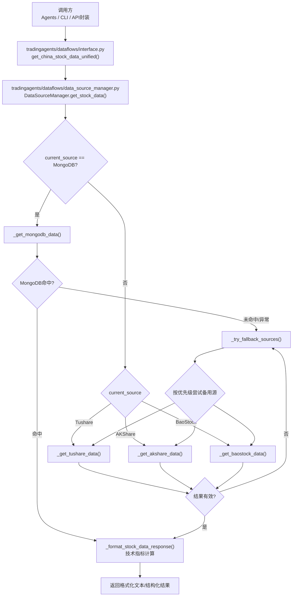
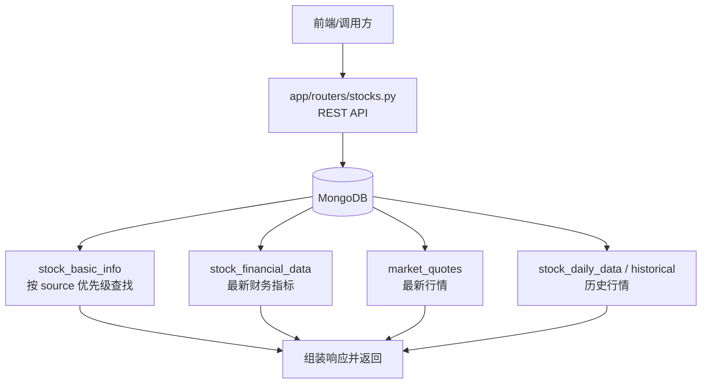
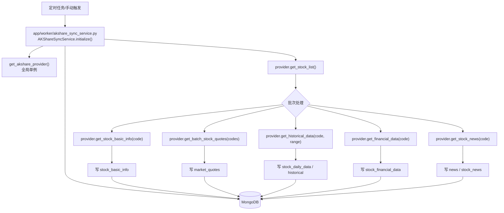
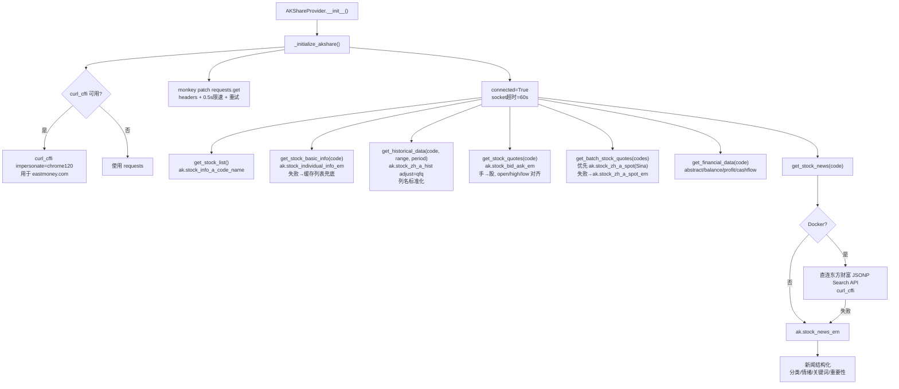

# 股票数据获取流程图（工程实现）

本文用 Mermaid 流程图把工程内“获取股票数据”的关键路径串起来，覆盖：

- 在线查询链路（tradingagents 调用数据源管理器，带缓存与降级）
- 后端 API 查询链路（FastAPI 从 MongoDB 读取）
- 后端数据同步链路（worker 从 Provider 拉取并写入 MongoDB）
- AKShareProvider 内部调用细节（反爬、重试、各接口调用）

## 在线查询链路（tradingagents：统一接口 → DataSourceManager → Provider）

关键实现位置：
- 统一入口： [interface.py:get_china_stock_data_unified](file:///e:/workspace/GitRepository/TradingAgents-CN/tradingagents/dataflows/interface.py#L1514-L1627)
- 调度与降级： [data_source_manager.py:get_stock_data](file:///e:/workspace/GitRepository/TradingAgents-CN/tradingagents/dataflows/data_source_manager.py#L1031-L1142)
- MongoDB 优先与降级： [data_source_manager.py:_get_mongodb_data](file:///e:/workspace/GitRepository/TradingAgents-CN/tradingagents/dataflows/data_source_manager.py#L1143-L1182)
- AKShare 历史数据拉取： [data_source_manager.py:_get_akshare_data](file:///e:/workspace/GitRepository/TradingAgents-CN/tradingagents/dataflows/data_source_manager.py#L1283-L1324)

## 后端 API 查询链路（FastAPI：MongoDB 读 → 返回）

这一条链路是“读库返回”，不直接调用外部数据源；外部数据源拉取通常由 worker 同步写入 MongoDB 后被查询到。

关键实现位置：
- A 股基础信息按 source 优先级读取： [stocks.py](file:///e:/workspace/GitRepository/TradingAgents-CN/app/routers/stocks.py#L251-L289)

## 后端数据同步链路（worker：Provider 拉取 → 标准化 → 写 MongoDB）

关键实现位置：
- 同步服务初始化与获取列表： [akshare_sync_service.py](file:///e:/workspace/GitRepository/TradingAgents-CN/app/worker/akshare_sync_service.py#L37-L114)

## AKShareProvider 内部数据获取细节（反爬/重试/标准化）

关键实现位置：
- 初始化、反爬补丁： [akshare.py:_initialize_akshare](file:///e:/workspace/GitRepository/TradingAgents-CN/tradingagents/dataflows/providers/china/akshare.py#L36-L167)
- 历史数据与列名标准化： [akshare.py:get_historical_data](file:///e:/workspace/GitRepository/TradingAgents-CN/tradingagents/dataflows/providers/china/akshare.py#L896-L998)
- 单只实时行情字段对齐： [akshare.py:get_stock_quotes](file:///e:/workspace/GitRepository/TradingAgents-CN/tradingagents/dataflows/providers/china/akshare.py#L702-L797)
- 批量实时行情快照： [akshare.py:get_batch_stock_quotes](file:///e:/workspace/GitRepository/TradingAgents-CN/tradingagents/dataflows/providers/china/akshare.py#L555-L701)
- 新闻（Docker 直连 + 回退 + 结构化）： [akshare.py:get_stock_news](file:///e:/workspace/GitRepository/TradingAgents-CN/tradingagents/dataflows/providers/china/akshare.py#L1183-L1362)
