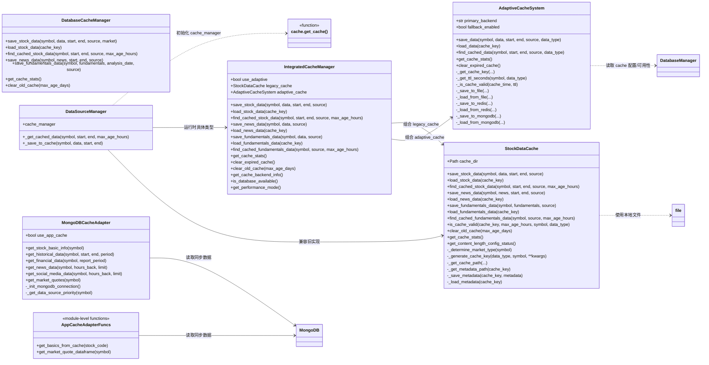

# Cache 模块整体结构与类图

本篇文档聚焦 `tradingagents.dataflows.cache` 模块，帮助你在脑中建立“缓存层”的整体模型：

- 统一入口：`get_cache()` 以及 `TA_CACHE_STRATEGY` 如何决定用哪套实现
- 三层职责：对外接口层 / 策略编排层 / 具体后端实现层
- 与 DataSourceManager、MongoDB 同步数据（app cache）的关系

---

## 1. 总览类图（Mermaid）

---

## 2. 模块入口与配置开关

### 2.1 统一入口 `cache.get_cache`

文件位置：[cache/__init__.py](file:///e:/workspace/GitRepository/TradingAgents-CN/tradingagents/dataflows/cache/__init__.py#L1-L114)

- 对外主入口 `get_cache()`：
  - 根据环境变量 `TA_CACHE_STRATEGY` 选择缓存策略
  - 默认值是 `integrated`
- 支持的策略：
  - `"integrated"` / `"adaptive"`：返回 [IntegratedCacheManager](file:///e:/workspace/GitRepository/TradingAgents-CN/tradingagents/dataflows/cache/integrated.py#L30-L399)
  - 其他值：返回 [StockDataCache](file:///e:/workspace/GitRepository/TradingAgents-CN/tradingagents/dataflows/cache/file_cache.py#L21-L685)

初始化失败会自动降级到文件缓存。

### 2.2 与 DataSourceManager 的连接点

文件位置：[data_source_manager.py](file:///e:/workspace/GitRepository/TradingAgents-CN/tradingagents/dataflows/data_source_manager.py#L57-L85)

- DataSourceManager 在 `__init__` 内创建统一缓存：`self.cache_manager = get_cache()`
- 行情缓存的读写都集中在：
  - [_get_cached_data](file:///e:/workspace/GitRepository/TradingAgents-CN/tradingagents/dataflows/data_source_manager.py#L608-L640)：`find_cached_stock_data` + `load_stock_data`
  - [_save_to_cache](file:///e:/workspace/GitRepository/TradingAgents-CN/tradingagents/dataflows/data_source_manager.py#L642-L661)：`save_stock_data`

---

## 3. IntegratedCacheManager：对外统一接口 + 策略编排

文件位置：[integrated.py](file:///e:/workspace/GitRepository/TradingAgents-CN/tradingagents/dataflows/cache/integrated.py#L30-L399)

### 3.1 职责

- 组合两套实现：
  - `legacy_cache`：始终存在的文件缓存 [StockDataCache](file:///e:/workspace/GitRepository/TradingAgents-CN/tradingagents/dataflows/cache/file_cache.py#L21-L685)
  - `adaptive_cache`：尽量启用的自适应缓存 [AdaptiveCacheSystem](file:///e:/workspace/GitRepository/TradingAgents-CN/tradingagents/dataflows/cache/adaptive.py#L19-L440)
- 对外暴露“向后兼容”的接口集合：
  - 股票数据：`save_stock_data / load_stock_data / find_cached_stock_data`
  - 新闻：`save_news_data / load_news_data`
  - 基本面：`save_fundamentals_data / load_fundamentals_data / find_cached_fundamentals_data`
  - 维护：`get_cache_stats / clear_expired_cache / clear_old_cache / get_cache_backend_info / is_database_available / get_performance_mode`

### 3.2 分支与降级

- 初始化阶段尝试构建 `AdaptiveCacheSystem`，成功则 `use_adaptive=True`
- 读写阶段按 `use_adaptive` 分流：
  - `True`：走 `AdaptiveCacheSystem.save_data/load_data/find_cached_data`
  - `False`：走 `StockDataCache.save_*/load_*/find_cached_*`
- 基本面缓存查找目前即使 `use_adaptive=True` 也仍走文件缓存，以维持旧逻辑兼容性（见 [find_cached_fundamentals_data](file:///e:/workspace/GitRepository/TradingAgents-CN/tradingagents/dataflows/cache/integrated.py#L195-L212)）。

---

## 4. AdaptiveCacheSystem：多后端自适应缓存

文件位置：[adaptive.py](file:///e:/workspace/GitRepository/TradingAgents-CN/tradingagents/dataflows/cache/adaptive.py#L19-L440)

### 4.1 核心思路

- 从 `DatabaseManager.get_config()` 读取 `config["cache"]`：
  - `primary_backend`：`redis` / `mongodb` / `file`
  - `fallback_enabled`：主要后端失败时是否降级到文件
  - `ttl_settings`：`{ "china_stock_data": seconds, "us_news_data": seconds, ... }`
- 用统一接口覆盖多种数据类型：
  - `save_data(..., data_type="stock_data/news_data/fundamentals_data")`
  - `load_data(cache_key)`
  - `find_cached_data(...)`

### 4.2 Key 与 TTL

- Key：`md5(f"{symbol}_{start}_{end}_{data_source}_{data_type}")`（见 [_get_cache_key](file:///e:/workspace/GitRepository/TradingAgents-CN/tradingagents/dataflows/cache/adaptive.py#L45-L49)）
- TTL：
  - 6 位纯数字 → china，否则 us（见 [_get_ttl_seconds](file:///e:/workspace/GitRepository/TradingAgents-CN/tradingagents/dataflows/cache/adaptive.py#L51-L62)）
  - 组合成 `ttl_key = f"{market}_{data_type}"` 并从配置取值

---

## 5. StockDataCache：纯文件缓存实现

文件位置：[file_cache.py](file:///e:/workspace/GitRepository/TradingAgents-CN/tradingagents/dataflows/cache/file_cache.py#L21-L685)

### 5.1 目录划分与元数据

- 按市场与数据类型拆分目录（us/china + stocks/news/fundamentals）
- 所有缓存都会写一份 `metadata/<cache_key>_meta.json`，用于：
  - TTL 校验（cached_at）
  - 按 symbol/data_source 等条件做“模糊查找”

### 5.2 Key 生成与命中策略

- Key 格式：`{symbol}_{data_type}_{md5(params)[:12]}`
  - params 中包含 start/end/source/market 等 kwargs（见 [_generate_cache_key](file:///e:/workspace/GitRepository/TradingAgents-CN/tradingagents/dataflows/cache/file_cache.py#L176-L186)）
- 查找股票缓存时：
  - 先做精确 key 校验（完全同参）
  - 再遍历 metadata 目录找“同 symbol + 同 data_type + 同 market_type (+ 可选 data_source)”并逐个做 TTL 校验（见 [find_cached_stock_data](file:///e:/workspace/GitRepository/TradingAgents-CN/tradingagents/dataflows/cache/file_cache.py#L354-L411)）

### 5.3 长文本跳过缓存

文件缓存可以启用“长度检查”机制（默认关闭），防止把极长文本写入磁盘：

- `should_skip_cache_for_content(content, data_type)`（见 [should_skip_cache_for_content](file:///e:/workspace/GitRepository/TradingAgents-CN/tradingagents/dataflows/cache/file_cache.py#L138-L175)）
- 当判定跳过时：
  - 不写数据文件
  - 仍写 metadata，并生成一个标记为 `skipped=True` 的虚拟 cache key，便于追踪

---

## 6. DatabaseCacheManager：MongoDB + Redis 专用缓存

文件位置：[db_cache.py](file:///e:/workspace/GitRepository/TradingAgents-CN/tradingagents/dataflows/cache/db_cache.py#L41-L577)

定位：一套“独立于 AdaptiveCacheSystem”的数据库缓存实现。

它直接使用 `pymongo` / `redis` 客户端，提供 MongoDB（持久化）+ Redis（短 TTL 加速）的一体化读写。

---

## 7. MongoDBCacheAdapter 与 app_adapter：同步数据优先

这两者都是“读 app 同步库”的适配层，属于 dataflows 的数据源分支，不属于“缓存 provider 结果”的那条链路。

### 7.1 MongoDBCacheAdapter

文件位置：[mongodb_cache_adapter.py](file:///e:/workspace/GitRepository/TradingAgents-CN/tradingagents/dataflows/cache/mongodb_cache_adapter.py#L18-L423)

- 开关：`use_app_cache_enabled()`（即 TA_USE_APP_CACHE 的读取封装）
- 主要能力：
  - 基础信息、历史行情、财务、新闻、社媒、行情快照
- 关键点：
  - `_get_data_source_priority(symbol)` 会从 `system_configs.data_source_configs` 中读启用项，并按 priority 排序（见 [_get_data_source_priority](file:///e:/workspace/GitRepository/TradingAgents-CN/tradingagents/dataflows/cache/mongodb_cache_adapter.py#L81-L158)）
  - 所有读取都会按优先级依次尝试不同 `data_source`

### 7.2 app_adapter 的模块级函数

文件位置：[app_adapter.py](file:///e:/workspace/GitRepository/TradingAgents-CN/tradingagents/dataflows/cache/app_adapter.py#L1-L118)

- `get_basics_from_cache(stock_code)`：读 `stock_basic_info`
- `get_market_quote_dataframe(symbol)`：读 `market_quotes` 并映射为单行 DataFrame

---

## 8. 典型调用链：行情请求到缓存读写

1. DataSourceManager 初始化缓存：`cache_manager = cache.get_cache()`
2. 非 MongoDB 数据源分支中优先读缓存：
   - `_get_cached_data` → `cache_manager.find_cached_stock_data` → `cache_manager.load_stock_data`
3. 缓存未命中则调用 provider 拉取数据并回写：
   - `_save_to_cache` → `cache_manager.save_stock_data`
4. cache_manager 的运行时类型决定落盘/落库：
   - `StockDataCache`：写本地目录 + metadata
   - `IntegratedCacheManager(use_adaptive=True)`：按 `primary_backend` 写 Redis/MongoDB，并可降级写文件
---

## 9. 小结

整体上，cache 模块已经把“对外接口”和“具体实现细节”很好地隔离开了：

- 绝大部分业务代码只依赖 `cache.get_cache()` 暴露的一组方法
- IntegratedCacheManager 负责在“老文件缓存”和“新自适应缓存”之间做选择与降级
- AdaptiveCacheSystem 再把 Redis/MongoDB/File 封装成统一的接口
- 文件缓存和 MongoDB/Redis 的落盘格式、TTL、命名规则都在各自模块里清晰可见

读代码时，可以优先记住三点：

1. 找入口：从 `cache/__init__.py` 和 `DataSourceManager` 看谁在用缓存
2. 看编排：从 `IntegratedCacheManager` 判断当前进程到底启用了哪些后端
3. 查落点：按需深入 `file_cache.py` / `adaptive.py` / `db_cache.py` / `mongodb_cache_adapter.py`，确认数据具体存在哪里

这样基本就能做到：给定任意一个接口调用，回答“它会把数据缓存到哪里、多久过期、key 长什么样”。
