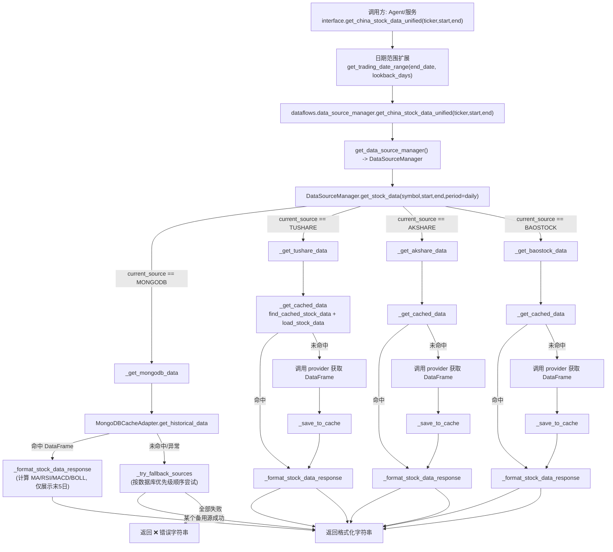

# A股统一行情接口执行路径：`get_china_stock_data_unified`

本文聚焦一条完整的执行链路：

**日期处理 → 调 `data_source_manager` → 先 MongoDB 再 provider → 缓存读写 → 格式化输出**

入口函数：[`interface.get_china_stock_data_unified`](file:///e:/workspace/GitRepository/TradingAgents-CN/tradingagents/dataflows/interface.py#L1514-L1628)

---

## 1. 总览流程图（Mermaid）

---

## 2. 关键入口与调用栈

- 入口：[`interface.get_china_stock_data_unified`](file:///e:/workspace/GitRepository/TradingAgents-CN/tradingagents/dataflows/interface.py#L1514-L1628)
- 转发：[`data_source_manager.get_china_stock_data_unified`](file:///e:/workspace/GitRepository/TradingAgents-CN/tradingagents/dataflows/data_source_manager.py#L2137-L2171)
- 统一分发：[`DataSourceManager.get_stock_data`](file:///e:/workspace/GitRepository/TradingAgents-CN/tradingagents/dataflows/data_source_manager.py#L1031-L1142)
- MongoDB 分支：[`DataSourceManager._get_mongodb_data`](file:///e:/workspace/GitRepository/TradingAgents-CN/tradingagents/dataflows/data_source_manager.py#L1143-L1182)
- 降级顺序：[`DataSourceManager._get_data_source_priority_order`](file:///e:/workspace/GitRepository/TradingAgents-CN/tradingagents/dataflows/data_source_manager.py#L91-L172)
- 备用源尝试：[`DataSourceManager._try_fallback_sources`](file:///e:/workspace/GitRepository/TradingAgents-CN/tradingagents/dataflows/data_source_manager.py#L1378-L1419)
- 缓存读写：[`_get_cached_data / _save_to_cache`](file:///e:/workspace/GitRepository/TradingAgents-CN/tradingagents/dataflows/data_source_manager.py#L608-L661)
- 输出格式化：[`_format_stock_data_response`](file:///e:/workspace/GitRepository/TradingAgents-CN/tradingagents/dataflows/data_source_manager.py#L682-L905)

---

## 3. 日期处理（“回溯扩窗”而非“找交易日”）

在 `interface.get_china_stock_data_unified` 中，入参 `start_date/end_date` 会被重算：

- 使用配置 `MARKET_ANALYST_LOOKBACK_DAYS`（读取失败默认 30）
- 以 `end_date` 为目标日期，向前回溯 `lookback_days` 天

代码位置：
- 日期扩窗逻辑：[`interface.py#L1531-L1560`](file:///e:/workspace/GitRepository/TradingAgents-CN/tradingagents/dataflows/interface.py#L1531-L1560)
- 实际实现：[`utils/dataflow_utils.get_trading_date_range`](file:///e:/workspace/GitRepository/TradingAgents-CN/tradingagents/utils/dataflow_utils.py#L93-L131)

注意点：
- `get_trading_date_range` 本质是 `target_date - timedelta(days=lookback_days)`，并不主动“跳过周末/节假日”。
- 这里通过“拉长窗口”提高拿到最新交易日数据的概率，真正的“只返回交易日数据”取决于后续数据源返回的 DataFrame。

---

## 4. DataSourceManager 如何决定“先 MongoDB 再 provider”

### 4.1 current_source 的来源

`DataSourceManager.__init__` 会根据 `use_app_cache_enabled()` 决定是否把 **MongoDB** 作为最高优先级数据源：

- 若启用 App Cache（MongoDB 同步数据）：`default_source = ChinaDataSource.MONGODB`
- 否则：使用环境变量 `DEFAULT_CHINA_DATA_SOURCE`（默认 AKShare）

代码位置：
- 初始化与默认源选择：[`data_source_manager.py#L57-L84`](file:///e:/workspace/GitRepository/TradingAgents-CN/tradingagents/dataflows/data_source_manager.py#L57-L84)
- 默认源判定：[`data_source_manager.py#L206-L223`](file:///e:/workspace/GitRepository/TradingAgents-CN/tradingagents/dataflows/data_source_manager.py#L206-L223)

### 4.2 MongoDB 分支做了什么

当 `current_source == MONGODB`：

1. 通过 `MongoDBCacheAdapter.get_historical_data(symbol,start,end,period)` 查询 MongoDB
2. 命中则把 DataFrame 交给 `_format_stock_data_response` 生成“技术分析文本”
3. 未命中/异常则进入 `_try_fallback_sources`（按优先级顺序去调用其他 provider）

代码位置：
- MongoDB 分支入口：[`get_stock_data`](file:///e:/workspace/GitRepository/TradingAgents-CN/tradingagents/dataflows/data_source_manager.py#L1067-L1080)
- MongoDB 获取：[`_get_mongodb_data`](file:///e:/workspace/GitRepository/TradingAgents-CN/tradingagents/dataflows/data_source_manager.py#L1143-L1182)
- MongoDB 适配器：[`MongoDBCacheAdapter.get_historical_data`](file:///e:/workspace/GitRepository/TradingAgents-CN/tradingagents/dataflows/cache/mongodb_cache_adapter.py#L160-L216)

---

## 5. 降级逻辑（Fallback）

### 5.1 触发条件

`get_stock_data` 会在两类情况下触发降级：

- “返回了结果但质量异常”：`result` 包含 `❌` 或 `错误`（见 `is_success` 判定）
- “发生异常”：直接 catch 后进入 fallback

代码位置：[`get_stock_data`](file:///e:/workspace/GitRepository/TradingAgents-CN/tradingagents/dataflows/data_source_manager.py#L1084-L1142)

### 5.2 降级顺序从哪里来

`_try_fallback_sources` 的 `fallback_order` 来自 `_get_data_source_priority_order(symbol)`：

- 先识别股票市场分类（A 股 / 美股 / 港股）
- 从数据库 `system_configs` 的 `data_source_configs` 读取启用项，并按 `priority` 逆序排列
- 过滤出当前仓库可用的数据源枚举
- 若数据库读取失败/无配置，则回退到默认顺序：`AKShare > Tushare > BaoStock`

代码位置：
- 市场识别：[`_identify_market_category`](file:///e:/workspace/GitRepository/TradingAgents-CN/tradingagents/dataflows/data_source_manager.py#L173-L205)
- 优先级顺序：[`_get_data_source_priority_order`](file:///e:/workspace/GitRepository/TradingAgents-CN/tradingagents/dataflows/data_source_manager.py#L91-L172)
- 备用源尝试：[`_try_fallback_sources`](file:///e:/workspace/GitRepository/TradingAgents-CN/tradingagents/dataflows/data_source_manager.py#L1378-L1419)

---

## 6. 缓存体系：在哪里读写、key 如何生成

### 6.1 DataSourceManager 里的缓存读写点

- 读取：`_get_cached_data` → `cache_manager.find_cached_stock_data` → `cache_manager.load_stock_data`
- 写入：`_save_to_cache` → `cache_manager.save_stock_data`

代码位置：[`_get_cached_data / _save_to_cache`](file:///e:/workspace/GitRepository/TradingAgents-CN/tradingagents/dataflows/data_source_manager.py#L608-L661)

### 6.2 cache_manager 的选择（Integrated / Adaptive / File）

Dataflows 的缓存入口是 `cache.get_cache()`，默认策略由 `TA_CACHE_STRATEGY` 决定：

- `integrated`/`adaptive`：优先使用 `IntegratedCacheManager`（内部可能启用 Redis/MongoDB/File 自适应）
- 其他：使用 `StockDataCache`（文件缓存）

代码位置：[`cache/__init__.py`](file:///e:/workspace/GitRepository/TradingAgents-CN/tradingagents/dataflows/cache/__init__.py#L1-L113)

`IntegratedCacheManager` 的关键行为：
- `find_cached_stock_data`：adaptive 模式走 `AdaptiveCacheSystem.find_cached_data`，否则走 `StockDataCache.find_cached_stock_data`
- `save_stock_data/load_stock_data`：同理

代码位置：[`integrated.py#L73-L155`](file:///e:/workspace/GitRepository/TradingAgents-CN/tradingagents/dataflows/cache/integrated.py#L73-L155)

### 6.3 key 生成规则

- **AdaptiveCacheSystem**：
  - key = `md5(f"{symbol}_{start}_{end}_{data_source}_{data_type}")`
  - 代码位置：[`adaptive.py#L45-L51`](file:///e:/workspace/GitRepository/TradingAgents-CN/tradingagents/dataflows/cache/adaptive.py#L45-L51)

- **文件缓存 StockDataCache**：
  - key = `f"{symbol}_{data_type}_{md5(params)[:12]}"`
  - `params` 会包含 start/end/source/market 等 kwargs（排序后拼接）
  - 代码位置：[`file_cache.py#L176-L186`](file:///e:/workspace/GitRepository/TradingAgents-CN/tradingagents/dataflows/cache/file_cache.py#L176-L186)

---

## 7. 格式化输出：返回的到底是什么

`_format_stock_data_response` 会把 DataFrame 变成一段“技术分析文本”（供 Agent 使用），核心特征：

- 先对全量数据计算指标：MA5/10/20/60、RSI（同花顺风格 RSI6/12/24 + 参考 RSI14）、MACD、BOLL
- 为降低 token：仅展示最近最多 5 个交易日
- 输出包含：最新价、涨跌额/涨跌幅、MA 位置判断、MACD 多空与金叉/死叉提示、RSI 超买/超卖与趋势、BOLL 位置、近期统计等

代码位置：[`_format_stock_data_response`](file:///e:/workspace/GitRepository/TradingAgents-CN/tradingagents/dataflows/data_source_manager.py#L682-L905)

---

## 8. 常用配置/环境变量速查

| 名称 | 作用 | 读取位置 |
| --- | --- | --- |
| `MARKET_ANALYST_LOOKBACK_DAYS` | 接口日期回溯天数（默认 30） | [`interface.py#L1538-L1552`](file:///e:/workspace/GitRepository/TradingAgents-CN/tradingagents/dataflows/interface.py#L1538-L1552) |
| `TA_USE_APP_CACHE`（通过 `use_app_cache_enabled()`） | 是否启用 MongoDB 同步缓存作为最高优先级数据源 | [`data_source_manager.py#L86-L90`](file:///e:/workspace/GitRepository/TradingAgents-CN/tradingagents/dataflows/data_source_manager.py#L86-L90) |
| `DEFAULT_CHINA_DATA_SOURCE` | 未启用 MongoDB 时的默认数据源（默认 AKShare） | [`data_source_manager.py#L206-L223`](file:///e:/workspace/GitRepository/TradingAgents-CN/tradingagents/dataflows/data_source_manager.py#L206-L223) |
| `TA_CACHE_STRATEGY` | 选择 integrated/adaptive/file 等缓存策略（默认 integrated） | [`cache/__init__.py#L55-L93`](file:///e:/workspace/GitRepository/TradingAgents-CN/tradingagents/dataflows/cache/__init__.py#L55-L93) |

---

## 9. 排错时最有效的 3 个落点

- 日期不对：先看日期扩窗后的 start/end 是否被重算（`interface` 会记录“原始输入/计算结果”）
- 没走到 MongoDB：看 `use_app_cache_enabled()` 是否为 True，以及 manager 初始化时 `default_source/current_source`
- 明明有数据却降级：看 `get_stock_data` 的 `is_success` 判定是否把结果当成“质量异常”（包含 `❌/错误`）
