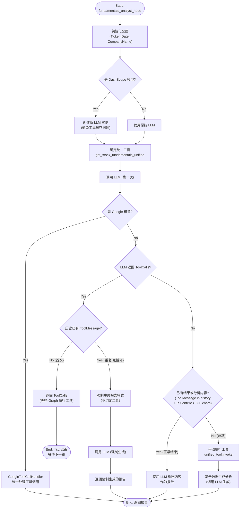

# 基本面分析师 (FundamentalsAnalyst) 流程详解

本文档详细描述了 `fundamentals_analyst.py` 中基本面分析师的工作流程。该节点负责获取股票的基本面数据（如财务报表、估值指标等）并生成分析报告。

## 核心流程图

## 详细逻辑说明

### 1. 初始化与模型适配
*   **股票信息识别**：首先根据 Ticker 识别市场（A股/港股/美股），并获取对应的公司名称。
*   **阿里百炼 (DashScope) 适配**：代码显式检查是否为 `DashScope` 模型。如果是，会创建一个新的 LLM 实例。这是为了解决该模型在 LangChain 中可能存在的工具缓存或状态残留问题。

### 2. 工具绑定
*   分析师只绑定一个核心工具：`get_stock_fundamentals_unified`。
*   该工具内部会自动处理不同市场的基本面数据获取逻辑。

### 3. Google 模型特殊处理
*   如果检测到是 Google (Gemini) 模型，直接转交给 `GoogleToolCallHandler`。
*   Google 模型在工具调用的格式和流程上与其他模型差异较大，因此使用专门的处理器来完成 "执行工具 -> 生成结果" 的全过程。

### 4. 标准模型流程控制
对于非 Google 模型，代码实现了复杂的控制流来防止死循环和处理异常情况：

*   **正常流程**：
    1. LLM 请求调用工具 (`ToolCalls > 0`)。
    2. 检查历史消息，确认没有调用过工具。
    3. 返回 `ToolCalls`，让外部图引擎（LangGraph）去执行工具。
    4. 下一轮进入节点时，历史消息中会有 `ToolMessage`。

*   **死循环防护 (CheckHistory)**：
    *   如果 LLM 请求调用工具，**但**历史消息中已经有了 `ToolMessage`（说明工具已经执行过了），这通常意味着 LLM 忽略了工具结果，试图重复调用。
    *   **对策**：进入“强制生成报告”模式。构建一个新的 Prompt（不绑定任何工具），强迫 LLM 基于现有的历史数据生成报告。

*   **异常回退 (Manual Fallback)**：
    *   如果 LLM **没有**请求工具，**也没有**生成有效的分析内容（内容长度 < 500）。
    *   **对策**：代码会在 Python 端手动执行 `get_stock_fundamentals_unified` 工具，获取数据，然后将数据直接拼接到 Prompt 中，要求 LLM 进行分析。这确保了即使 LLM "犯傻"（忘记调用工具），系统也能产出报告。
