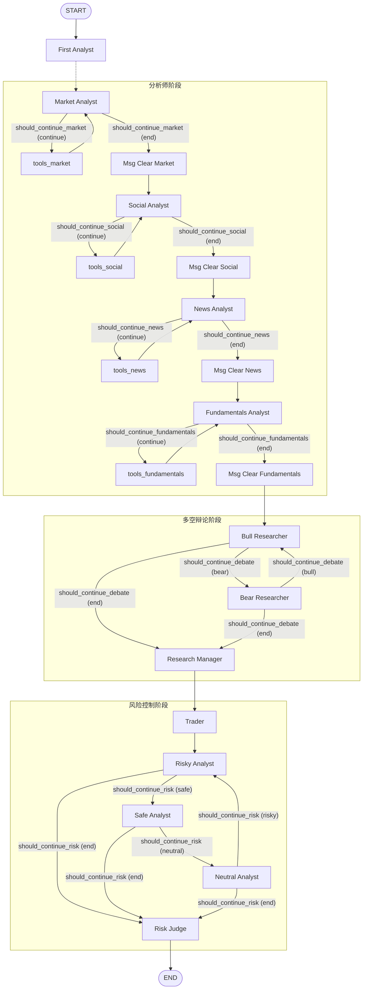

# Trading Agents Graph 流程图

本文档展示了 `setup.py` 中构建的 Trading Agents 工作流图。

## 整体架构流程图

## 流程说明

整个工作流分为三个主要阶段：

### 1. 分析师阶段 (Analysts)
*   **顺序执行**：分析师按照配置的顺序依次执行（默认为 Market -> Social -> News -> Fundamentals）。
*   **工具循环**：每个分析师都有自己的工具节点 (`tools_*`)。分析师会根据 `should_continue_*` 条件判断是否继续调用工具。
    *   如果需要调用工具，进入工具节点，执行后返回分析师节点。
    *   如果分析完成，进入清理节点 (`Msg Clear *`)，清理中间消息，然后传递给下一个分析师。
*   **消息清理**：为了防止上下文过长，每个分析师结束后都会清理掉自己产生的工具调用和中间思考过程，只保留最终报告。

### 2. 多空辩论阶段 (Debate)
*   **看多研究员 (Bull Researcher)**：基于所有分析师的报告，寻找看多的理由。
*   **看空研究员 (Bear Researcher)**：基于所有分析师的报告，寻找看空的风险。
*   **循环辩论**：两者通过 `should_continue_debate` 条件进行循环辩论，互相反驳对方的观点。
*   **研究经理 (Research Manager)**：当辩论结束时，由研究经理进行总结，综合双方观点。

### 3. 交易与风控阶段 (Trade & Risk)
*   **交易员 (Trader)**：基于研究经理的总结，生成初步的交易计划。
*   **风险分析师小组**：
    *   **Risky Analyst**：激进派，寻找激进的获利机会。
    *   **Safe Analyst**：保守派，关注潜在的下行风险。
    *   **Neutral Analyst**：中立派，平衡两者观点。
    *   这三者通过 `should_continue_risk_analysis` 进行循环讨论。
*   **风险裁判 (Risk Judge)**：最终决策者，综合交易计划和各方风险观点，生成最终的交易指令。
