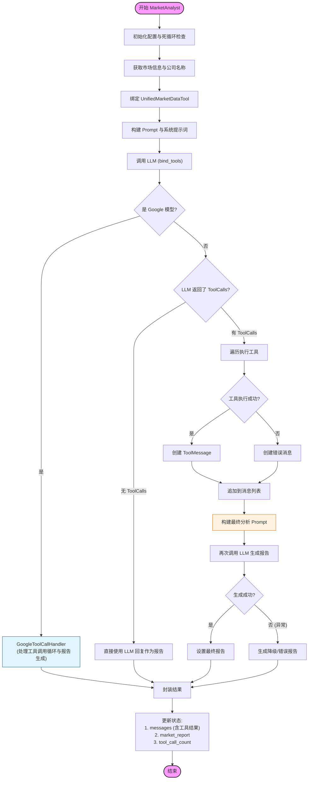

# 市场分析师 (Market Analyst) 工作流程

本文档描述了 `MarketAnalyst` 节点的内部工作流程。该分析师负责根据股票代码获取市场数据（如技术指标、价格走势），并生成技术分析报告。

## 核心流程图

## 流程详解

1.  **初始化与信息获取**
    *   从状态中获取 `ticker`、`date` 以及当前的 `tool_call_count`。
    *   识别市场类型（A股/港股/美股）。
    *   解析公司名称（通过统一接口或映射表）。

2.  **Prompt 构建**
    *   构建包含系统指令、分析对象信息和输出格式要求的 Prompt。
    *   特别强调输出格式（Markdown 标题、禁止 Emoji、货币符号等）。

3.  **LLM 初次调用**
    *   使用 `bind_tools` 绑定 `get_stock_market_data_unified` 工具。
    *   将当前对话历史发送给 LLM。

4.  **Google 模型特殊处理**
    *   如果检测到是 Google (Gemini) 模型，移交给 `GoogleToolCallHandler`。
    *   该处理器内部实现了 "执行工具 -> 获取结果 -> 生成最终报告" 的完整闭环。

5.  **标准模型处理 (手动闭环)**
    *   **无工具调用**：如果 LLM 直接返回了文本（可能是拒绝或闲聊），直接将其作为报告内容（注：此处没有像 NewsAnalyst 那样的强制补救机制）。
    *   **有工具调用**：
        1.  解析 `tool_calls`。
        2.  遍历执行每个工具（主要是 `get_stock_market_data_unified`）。
        3.  将工具执行结果封装为 `ToolMessage`。
        4.  **构建二次 Prompt**：手动构建一个新的 Prompt，包含之前的对话历史、工具结果以及一个明确的指令："现在请基于上述工具获取的数据，生成详细的技术分析报告..."。
        5.  **二次调用 LLM**：将完整的消息链发回 LLM，要求其生成最终的 Markdown 报告。

6.  **异常处理**
    *   如果在工具执行或二次生成过程中发生异常，会捕获异常并生成一个降级的错误报告，避免整个 Agent 崩溃。

7.  **结果封装与状态更新**
    *   返回包含完整历史（初次调用 + 工具结果 + 最终报告）的消息列表。
    *   更新 `market_report`。
    *   **关键**：手动增加 `market_tool_call_count`，防止外层图循环陷入死循环。
