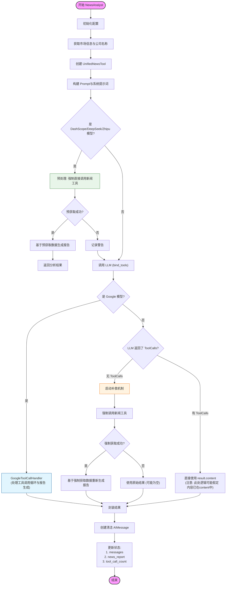

# 新闻分析师 (News Analyst) 工作流程

本文档描述了 `NewsAnalyst` 节点的内部工作流程。该分析师负责根据股票代码获取相关新闻，分析市场情绪，并生成投资建议。

## 核心流程图

## 流程详解

1.  **初始化与信息获取**
    *   从状态中获取 `ticker` 和 `date`。
    *   识别市场类型（A股/港股/美股）。
    *   解析公司名称（如将代码转换为"贵州茅台"）。

2.  **模型特定预处理 (Optimization)**
    *   针对 DashScope (阿里)、DeepSeek、Zhipu (智谱) 等模型。
    *   **目的**：避免这些模型在工具调用上的不稳定性。
    *   **动作**：在调用 LLM 之前，直接在 Python 代码中执行 `UnifiedNewsTool`。
    *   如果获取到新闻，直接将新闻拼接到 Prompt 中让 LLM 分析，**跳过后续所有步骤**。

3.  **LLM 调用**
    *   如果预处理未命中或失败，执行标准的 LLM 调用 (`chain.invoke`)。
    *   模型绑定了 `get_stock_news_unified` 工具。

4.  **Google 模型特殊处理**
    *   如果检测到是 Google (Gemini) 模型，移交给 `GoogleToolCallHandler`。
    *   该处理器内部实现了 "执行工具 -> 获取结果 -> 生成最终报告" 的完整闭环。

5.  **标准模型处理与补救**
    *   **无工具调用 (Zero Tool Calls)**：
        *   如果 LLM 没有调用工具（直接返回了闲聊或拒绝），触发**补救机制**。
        *   系统强制调用新闻工具，将结果再次喂给 LLM 生成报告。
    *   **有工具调用**：
        *   当前代码逻辑中，如果非 Google 模型返回了工具调用，系统倾向于直接使用其 `content`（注意：这里可能存在逻辑分支的简化，通常 OpenAI 模型在调用工具时 content 为空，依赖 Graph 的下一跳来执行工具，但 NewsAnalyst 似乎试图在节点内闭环或返回清洁消息）。

6.  **结果封装**
    *   生成一个不包含工具调用信息的 `AIMessage` (清洁消息)。
    *   更新 `news_report` 状态。
    *   增加 `news_tool_call_count` 计数器以防止死循环。
